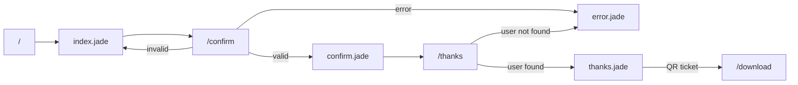
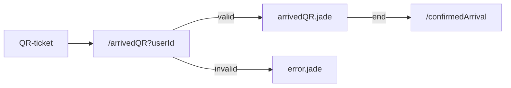

# Event Planner
Pet project to manage QR invitations and RSVPs for events

## Storage
Mongo DB free hosting is used at https://cloud.mongodb.com/

## Deployment
NodeJS free hosting rener is used at https://dashboard.render.com/

## Ticket generation
Get a ticket template from here https://www.canva.com/ and put it under tickets/ with the name template.png

## Configuration
Sample config is located here .env.template please add necesary variables and start the app with:

```sh
npm install
npm run dev
```
For production the script used is:

```sh
npm start
```

## Flow
Input (Email, phone) -> Customized confirmation form -> Thanks and Tickets? QR
QR -> On the day confirmation

### QR Ticket generation 


### Arrival confirmation from QR ticket 



confirm.jade(estimatedChildCount->assistingChildren)->thanks(assistingChildren->confirmedChildCount)->arrivedQR.jade(arrivedChildren->arrivedChildCount)


## Useful links
For timezones
https://www.timezoneconverter.com/cgi-bin/zonehelp.tzc?cc=MX&ccdesc=Mexico
https://www.timestamp-converter.com/
https://dencode.com/en/date/iso8601