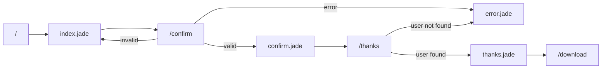

# eventplanner
Pet project to manage QR invitations and RSVPs for events

# Storage
Mongo DB used here https://cloud.mongodb.com/

# Deployment
https://dashboard.render.com/

# Flow
Input (Email, phone) -> Customized confirmation form -> Thanks and Tickets? QR
QR -> On the day confirmation

# Ticket generation
Get a ticket template from here https://www.canva.com/ and put it under tickets/ with the name template.png